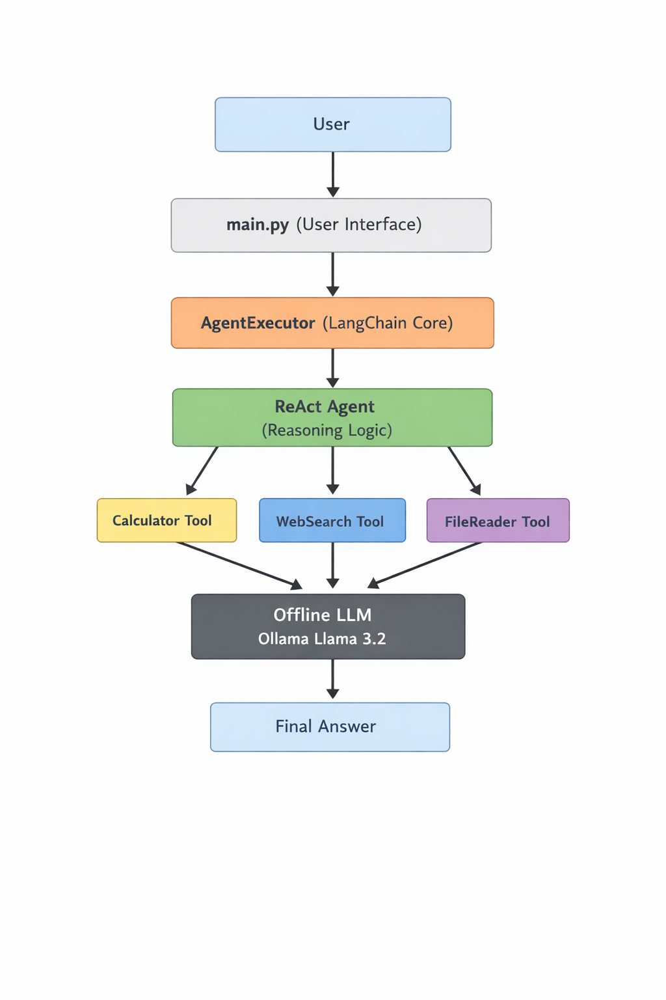

# Tool Calling Agent with LangChain AgentExecutor

## Project Overview

This project implements a Tool-Calling Agent using LangChain. The agent
dynamically selects and uses multiple tools based on user input.

The system uses LangChain's initialize_agent and AgentExecutor with
ReAct style reasoning.

The agent supports the following tools:

-   Calculator Tool
-   Web Search Tool
-   File Reader Tool

The agent uses an offline Large Language Model via Ollama, so no OpenAI
API key is required.

------------------------------------------------------------------------

## System Architecture

USER → main.py → AgentExecutor → ReAct Agent → Tools → Offline LLM →
Response → USER

Tools:

-   Calculator Tool
-   Web Search Tool
-   File Reader Tool

------------------------------------------------------------------------

## Chain Configuration

initialize_agent and AgentExecutor are used to configure the agent and
execution control.

AgentExecutor ensures controlled reasoning, tool execution, and max
iteration limit.

------------------------------------------------------------------------

## Prompt Template

ReAct prompting format:

Thought Action Observation Final Answer

This enables dynamic reasoning and tool selection.

------------------------------------------------------------------------

## Installation

Create virtual environment:

python -m venv .venv

Activate:

.venv`\Scripts`{=tex}`\activate`{=tex}

Install requirements:

pip install -r requirements.txt

Install Ollama:

https://ollama.com

Pull model:

ollama pull llama3.2:3b

Create .env file:

MODEL_NAME=llama3.2:3b TEMPERATURE=0 MAX_ITERATIONS=5
USE_MOCK_SEARCH=false

------------------------------------------------------------------------

## Run

python -m app.main

------------------------------------------------------------------------

## Example Usage

calculate 10\*5

search who is Abdul Kalam

read sample_files/notes.txt

summarize sample_files/notes.txt

------------------------------------------------------------------------

## Logging

Verbose logging enabled using Python logging and AgentExecutor verbose
mode.

------------------------------------------------------------------------

## Error Handling

Error handling implemented using try-except blocks and tool level
validation.

------------------------------------------------------------------------

